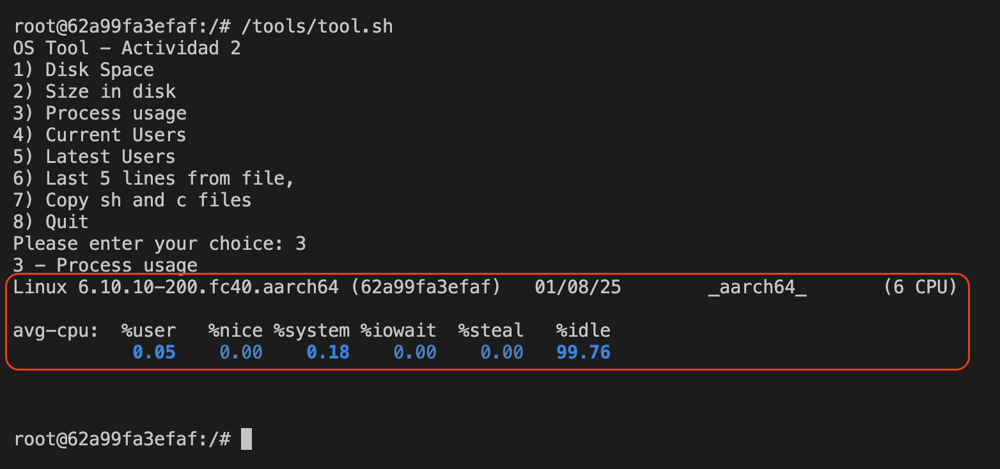

# UNIR Sistemas Operativos Avanzados - Actividad 2

## Introducción

El script creado contiene un menú con un `do case` para seleccionar la opción a ejecutar.

Funcionalidades que requieran más de una línea, están externalizadas en una función de bash. Por ejemplo, `copy_sh_and_c_files`.

> Comprueba que tools.sh tiene permisos de ejecución con `ls -l scripts/tools.sh.
>
> Si no es así, da permisos con este comando:
>
> ```bash
> chmod u+x scripts/tool.sh
> ```

### Compatibilidad

La compatibilidad del script ha sido probada en MacOS Sequoia 15.1.1 (24B91) (localmente) y en un Ubuntu 25.04 ejecutado como container con [Podman](https://podman.io/), open source container engine creado por RedHat. Podman tiene funcionalidad equivalente a Docker, con un `alias docker=podman` la migración sería transparente para el usuario.

> Con Docker no es necesario. Para usar Podman, a diferencia de Docker, necesitamos crear y arrancar la máquina virtual donde se ejecuta el container engine.
> Si no tienes máquina virtual, ejecuta `podman machine init` para crear/iniciar una.
> Una vez creada, ejecuta `podman machine start`.

Para simplificar la creación de un Ubuntu compatible y con más funcionalidad, este proyecto contiene un `Containerfile` (equivalente a [Dockerfile](https://docs.docker.com/reference/dockerfile/)) donde se actualizan los repositorios de Ubuntu, y se instalan los siguientes paquetes básicos:

- `sysstat`,
- `build-essential`,
- `curl`,
- `git`,
- `htop`,
- `man`,
- `unzip`,
- `vim`,
- `wget`
- `tree`

> `sysstat` es el único requisito mínimo para ejecutar `tool.sh`, en concreto la opción 3 "Obtener el uso del procesador" porque requiere el uso de `iostat` contenido en este paquete.

Para construir la imagen, ejecutemos el siguiente comando:

```bash
podman build -t ssoo-ubuntu .
```

## Ejecución

### Ubuntu en contenedor

- `podman run` pide a Podman ejecutar un nuevo contenedor
- `--rm` borra el contenedor cuando la ejecución termina.
- `--name ubuntu` le da nombre al contenedor para hacer referencia posteriormente en vez de asignarle un nombre por defecto.
- `-it` envía la entrada y salida del contenedor a standard output e input de nuestra terminal.
- `-v $(pwd)/scripts/:/tools` mapea el directorio `scripts` del repositorio con un directorio `/tools` dentro del contenedor. Así tenemos acceso a `/scripts/tools.sh` en el path `/tools/tool.sh` dentro del contenedor.
- `localhost/tools:latest` es el nombre de la imagen Ubuntu 25.04 que hemos creado en los pasos anteriores.
- `/bin/bash` nos abre una terminal dentro del contenedor.

```bash
podman run \
    --rm \
    --name ssoo-ubuntu \
    -it \
    -v $(pwd)/scripts/:/tools \
    -v $(pwd)/test/:/test \
    localhost/ssoo-ubuntu:latest \
    /bin/bash
```

### Ejercicio 1: Obtener el espacio libre del disco

```bash
/tools/tool.sh
```

> Selecciona la opción 1


Debido al overlay que hace podman del disco y el mapeo de volúmenes como `/test`, vemos que el directorio `/` tiene 100G, 29G usados y 72G libres, lo que hace un 29% de uso de disco. Esta memoria es virtual asignada a la máquina de Podman. Y luego que `/test` tiene 461G con un uso del 98%. Un momento estupendo para limpiar disco en el MacOS que contiene Podman :)

### Ejercicio 2: Obtener el tamaño ocupado por un determinado directorio y sus ficheros y subdirectorios

```bash
/tools/tool.sh /test
```

> Selecciona la opción 2


### Ejercicio 3: Obtener el uso del procesador

> On ubuntu, container image, install sysstat:
> Update repositories: `apt update -y`
> Install package: `apt install -y sysstat`

```bash
/tools/tool.sh
```

> Selecciona la opción 3



El comando `iostat -c` devuelve información sobre el sistema, en este caso un kernel 6 de linux, ya que estamos usando Ubuntu 25.04 y una arquitectura ARM ya que el hardware usado es MacBook M1 Chip.

`user` muestra el uso medio de CPU para el usuario.

`nice` indica la carga de CPU debido a procesos con `setpriority`. O el equivalente en sistemas antiguos, `nice`.

`iowait` son tiempos de espera donde el procesador no ha saltado a otro proceso, pero está esperando a una operación de entrada y salida.

`steal` es tiempo de hypervisor o container engine. Un valor a tener en cuenta si sospechamos que el problema puede ser que nuestra máquina (bare metal o host) está soportando muchas máquinas virtuales en un punto que está saturando al hypervisor.

`idle` que es el resto del tiempo que no está haciendo nada productivo. En este caso, el sistema no está bajo ninguna carga.

### Ejercicio 4: Obtener el número de usuarios conectados

```bash
/tools/tool.sh
```

> Selecciona la opción 4


Ejecutando el comando en el contenedor de Ubuntu porque estamos usando el comando `w` que según la documentación oficial con `man w` _Show who is logged on and what they are doing_. Y `logged` nos da la clave del resultado. Containers son procesos usando `cgroup` y `namespaces` del Kernel de Linux. Y cuando ejecutamos el proceso bash, no estamos haciendo logging en la máquina, sino ejecutando ese proceso.

Para confirmar esta hipótesis, en una máquina virtual Ubuntu 24.04 en Parallels (un hypervisor para MacOS) nos da un valor más acorde, porque en este caso sí estás logged dentro de la máquina.

Veámoslo en el pantallazo a continuación:


El usuario `parallels` (usuario creado por defecto en VMs en Parallels) con su hora y qué está haciendo. Dado que el comando se ejecuta desde una terminal de Gnome, ahí tenemos el comando concreto `gnome-session-binary`.

### Ejercicio 5: Obtener el número de usuarios conectados desde la última vez que se preguntó

```bash
/tools/tool.sh
```

> Selecciona la opción 5

Recibimos el siguiente ERROR:

```
Please enter your choice: 5
5 - Latest Users
/tools/tool.sh: line 42: last: command not found
root@62a99fa3efaf:/# last
bash: last: command not found
```

El comando `last` no se ha encontrado. Parece que hemos topado con un error en Ubuntu 25.04 según este post: [“last” command is not found on Plucky 25.04](https://discourse.ubuntu.com/t/last-command-is-not-found-on-plucky-25-04/51215/3) del foro de Ubuntu.

Recomiendan reinstalar el paquete `wtmpdb` que mantiene los logs de usuarios.

```bash
apt install --reinstall  wtmpdb
```

Comprobamos versión y que se ha instalado adecuadamente:

```bash
apt policy wtmpdb
```

Seguimos encontrando un ERROR, aunque diferente:

```
Please enter your choice: 5
5 - Latest Users
open_database_ro: Cannot open database (/var/lib/wtmpdb/wtmp.db): unable to open database file
```

A pesar de ser usuario root, no podemos abrir el fichero `/var/lib/wtmpdb/wtmp.db`. Con `ls /var/lib/wtmpdb/wtmp.db` vemos que el fichero no existe.

Haciendo un `ls /var/lib/wtmpdb/` vemos que no hay ningún fichero dentro del directorio, aunque el directorio existe.

En este punto, lamento haber probado con Ubuntu 25.04 en container pero mi hipótesis es que, a pesar de reinstalar el paquete, como no hacemos login/logout en la máquina (ya que es un container, es decir, un proceso) la base de datos `wtmp.db` no se ha creado en el sistema.

Vamos a hacer la misma prueba en Ubuntu 24.04 en máquina virtual.


En una máquina virtual con Ubuntu 24.04 el resultado es el esperado.

### Ejercicio 6: Mostrar las últimas cinco líneas de un fichero de texto que se pasa como parámetro con su ubicación completa

```bash
/tools/tool.sh /test/leave_me_alone.txt
```

> Selecciona la opción 6


El fichero `/test/leave_me_alone.txt` tiene líneas numeradas para ayudar a comprobar el resultado de este ejercicio.

El resultado de `tail -n 5 $(realpath $1)` es imprimir en pantalla las últimas 5 líneas del fichero pasado por parámetro número `1`. Usamos `realpath` para limpiar el path pasado por parámetro.

### Ejercicio 7: Copiar todos los archivos con extensión .sh y .c de un directorio origen pasado como parámetro a un directorio destino pasado como parámetro.

```bash
/tools/tool.sh /test backup
```

> Selecciona la opción 7


En este ejercicio se llama a una función en bash que copia ficheros con las extensiones `.sh` y `.c` del directorio pasado en el primer parámetro, en este ejemplo `/test`. Y crea un directorio, en este ejemplo `/backend` pasado como segundo parámetro que es el destino de los ficheros copiados.

Se usa `cp` que acepta ficheros y considera el último parámetro como el destino.

Usamos `tree` para mostrar los ficheros, aunque se podría usar `ls`.

`tree` imprime toda la jerarquía de ficheros dentro del directorio. Me ha hecho pensar que sería interesante incluir la opción de copiar todos los ficheros `.sh` y `.c` independientemente de la profundidad a la que se encuentren.

Para este nuevo ejercicio deberíamos usar `find` de la siguiente manera:

```bash
cp $(find /test -type f -iname \*\.sh -o -iname \*\.c) /backup/
```

La parte importante está en el `find` donde `/test` es el sitio donde queremos buscar.

`-type f` indicamos que solo queremos ficheros.

`-iname` hace un case insensitive match por nombre.

`-o` es un OR dando por válida cualquiera de las condiciones que son verdaderas.

## Dificultades

- `realpath` necesario cuando se resuelve `.` y `..` pasado por parámetro de la herramienta
- `declare -a` necesario en Ubuntu, si no da error al encontrar el primer paréntesis `(`

## Bibliografía

- [Ubuntu - How can I create a select menu in a shell script?](https://askubuntu.com/questions/1705/how-can-i-create-a-select-menu-in-a-shell-script)
- [Baeldung Linux - Creating a Simple Select Menu in the Shell Script](https://www.baeldung.com/linux/shell-script-simple-select-menu)
- [nixCraft - Linux List Current Logged In Users](https://www.cyberciti.biz/faq/unix-linux-list-current-logged-in-users/)
- [w(1) — Linux manual page](https://man7.org/linux/man-pages/man1/w.1.html)
- [Ubuntu - When writing a bash script, how do I get the absolute path of the location of the current file?](https://askubuntu.com/questions/893911/when-writing-a-bash-script-how-do-i-get-the-absolute-path-of-the-location-of-th)
- [Stackoverflow - How do I check if a directory exists or not in a Bash shell script?](https://stackoverflow.com/questions/59838/how-do-i-check-if-a-directory-exists-or-not-in-a-bash-shell-script)
- [Bash Array – How to Declare an Array of Strings in a Bash Script](https://www.freecodecamp.org/news/bash-array-how-to-declare-an-array-of-strings-in-a-bash-script/)
- [“last” command is not found on Plucky 25.04](https://discourse.ubuntu.com/t/last-command-is-not-found-on-plucky-25-04/51215/3)
